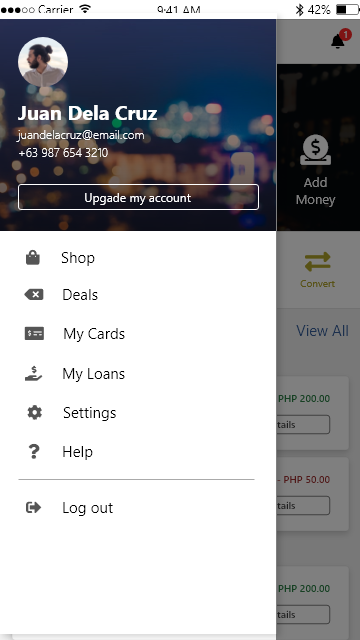

<h1>PayLight UI</h1>

PayLight is a mobile banking, wallet, and payment service app.

 

<h2>Instructions</h2>

Please donwload Adobe XD and open the `PayLight.xd` file

 

<h2>Screenshots</h2>

<table>
    <tr>
        <td style="border: solid #888 1px">
            
            
On Start

        </td>
        <td style="border: solid #888 1px">
            
            
On Start - Type

        </td>
        <td style="border: solid #888 1px">
            
            
Log In - Failed

        </td>
    </tr>
    <tr>
        <td style="border: solid #888 1px">
            
            
Create Account - Step 1

        </td>
        <td style="border: solid #888 1px">
            
            
Create Account - Step 2

        </td>
        <td style="border: solid #888 1px">
            
            
Create Account - Step 3

        </td>
    </tr>
    <tr>
        <td style="border: solid #888 1px">
            
            
Dashboard

        </td>
        <td style="border: solid #888 1px">
            
            
Recent Activities

        </td>
        <td style="border: solid #888 1px">
            
            
Recent Activities -

        </td>
    </tr>
    <tr>
        <td style="border: solid #888 1px">
            
            
Menu

        </td>
        <td style="border: solid #888 1px">
            
            
Send - Section 1

        </td>
        <td style="border: solid #888 1px">
            
            
Send - Section 2

        </td>
    </tr>
    <tr>
        <td style="border: solid #888 1px">
            
            
Send Message - Section 2

        </td>
        <td style="border: solid #888 1px">
            
            
Send - Section 1

        </td>
        <td style="border: solid #888 1px">
            
            
Recent Activities - Modal

        </td>
    </tr>
    <tr>
        <td style="border: solid #888 1px">
            
            
Pay Bills

        </td>
        <td style="border: solid #888 1px">
            
            
Pay Bills - Selected Service

        </td>
        <td style="border: solid #888 1px">
            
            
Pay Bills - Confirmation

        </td>
    </tr>
    <tr>
        <td style="border: solid #888 1px">
            
            
Pay Bills - Success

        </td>
        <td style="border: solid #888 1px">
            
            
Buy Load

        </td>
        <td style="border: solid #888 1px">
            
            
Buy Load - Selected User

        </td>
    </tr>
    <tr>
        <td style="border: solid #888 1px">
            
            
Buy Load - Confirmation

        </td>
        <td style="border: solid #888 1px">
            
            
Buy Load - Success

        </td>
    </tr>
</table>